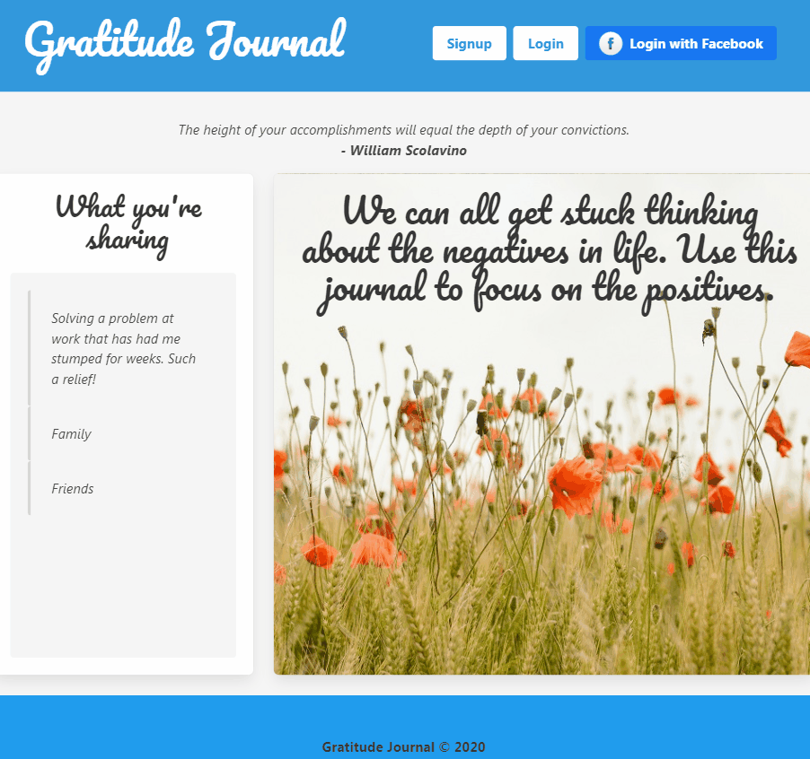

# Gratitude Journal

## Description 
   [](https://travis-ci.org/CazB67/gratitude-journal)

To create a full stack application where users can log gratitudes, be presented with inspiring quotes and log random acts of kindness. Gratitude is the ability to pay attention to what you have, instead of worrying about what you don't have. In the book 'The Resilience Project' by Hugh Van Cuylenburg he writes about finding happiness through gratitude, empathy and mindfulness. By simply writing down our gratitudes daily we can become happier individuals. Van Cuylenburg describes the neuroscience behind kindness explaining that 'when you do something kind for someone else, your brain releases oxytocin' and this hormone 'allows us to feel joy, happiness and love'(p.73). The acts of kindness need not be extravagent, eg a phone call or opening a door for someone. There are many print gratitude journals in the market, this app offers an easily accessible and easy to use alternative.

## Table of Contents
1. [User Story](#User-Story)
2. [Acceptance Criteria](#Acceptance-Criteria)
3. [Wireframe](#Wireframe)
4. [Installation](#Installation)
5. [Usage](#Usage)
6. [Technologies](#Technologies)
7. [Rough Breakdown of Tasks ](#Rough-Breakdown-of-Tasks)
8. [Ideas For Future Development](#Ideas-For-Future-Development)
9. [Credits](#Credits)
10. [Contributing](#Contributing)
11. [Licence](#License)

## User Story
```
As a user I want to document the things I am thankful for and my acts of kindness to bring about positive change in my life. 
```

## Acceptance Criteria
```
WHEN I first arrive at the webpage, I login with my username and password.
THEN I am redirected to a journal 'page' and presented with an inspiring quote.
THEN I can enter what I am grateful and an act of kindness.
THEN I can save gratitude and act of kindness and click a checkbox if I want to share anonymously on the login page
WHEN I click on a date in the calendar I can look back on past gratitudes.
THEN I can reflect on all that is good in my life
```

## Wireframe 
Wireframe URL is https://miro.com/app/board/o9J_ksdsbQw=/

## Installation

Run `npm install`

Add MySql password to a `.env` file eg PASSWORD="xxx"

If wanting to run facebook auth create an app at `https://developers.facebook.com/` and put the App ID, App Secret and callback URL in the `.env`. Check that App ID, App Secret and callback URL environmental variable names match in `passport.js`.

Run `npm start`

## Usage
* The URL of the deployed application is https://safe-dawn-22162.herokuapp.com/

* The URL of the GitHub repository is https://github.com/CazB67/https://github.com/CazB67/gratitude-journal

The following GIF shows the application's functionality and how to use. 



## Technologies
- express
- nodejs
- html
- css
- JQuery
- sequelize
- handle-bars
- Bulma css framework
- path
- mySql
- Heroku
- Github
- passport
- TavoCalendar - https://github.com/beinoriusju/TavoCalendar
- Quotes Free API - https://www.freecodecamp.org/forum/t/free-api-inspirational-quotes-json-with-code-examples/311373
- Toastr - https://github.com/CodeSeven/toastr

## Rough Breakdown of Tasks 
- Front End (Vasavi, Caroline)
- Backend (Nathan, Raed)

## Ideas for Future Development
- Send a message to someone, to let them know you are thinking of them
- Show streak eg "Wow! You have used this journal for 3 days straight."
- An uplifting news story
- Create an admin user that can delete users etc.
- Update gratitude

## Credits
- Team at UWA Coding Bootcamp

## Contributing
[](code_of_conduct.md)

## License
 
